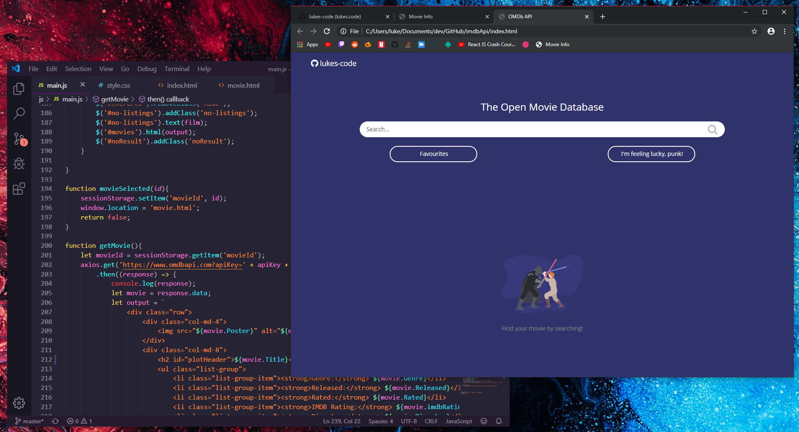

# IMDB-Replica

### View this web page at : https://hardik1008.github.io/IMDb/

## Features

* Home Page
  1.  Search any movie in the home page search bar {as you type the search results updates, just like Google does for suggestions}.
  2.  Each search result of the movie has a favourite button, clicking on which the movie is added to “My favourite movies page”.
  3.  On clicking any particular search result (any movie), A new page with more information about that movie is open.

* Movie Page
  1. It shows information about the movie like its name, photo, plot, etc.

* My Favourite Movie Page
  1.  Display a list of all the favourite movies.
  2.  It can have the same number of movies before and after closing the browser/refreshing the browser.
  3.  Remove from favourites button: Each movie has been removed from the favourites button, clicking on which movie was removed from the list.

A movie search website using the OMDb Api for IMDb

rocketrocketrocketrocketrocketrocketrocketrocketrocketrocketrocketrocketrocketrocketrocketrocketrocketrocketrocketrocket

This may still undergo development, road map as follows:

heavy_check_mark Successful response from ombdApi
heavy_check_mark Grid system
heavy_check_mark Individual information pages with ext. link to IMDb pages
heavy_check_mark CSS
heavy_check_mark My personal favourite films/shows

movie_camera This project works by searching the IMDb through the OMDb API.
The search bar send a request based on the information you have typed in and returns the most relevant movies!
The most fun part about this project was allowing the user to create their own favourites, they can do so by checking the star next to the corresponding movie, this information is stored in an array before being converted to JSON and saved in localStorage. When the user then visits the "my favourites" section the JSON is converted back in to an array, firing off a request based on the information saved and once again returning the relevant movies. Because the information is saved in localStorage, the user can research and navigate to which ever page they please without losing their favourites. This also works backwards in that if you 'un-star' a movie it is subsequently removed from your favourites! Each movie's star remains 'starred' or 'un-starred' when navigating through the Open Movie Database thanks to the localStorage also!

This project was made with the following:
HTML
CSS
JavaScript
jQuery
OMDbApi
Axios HTTP client

# Mockup Images
____________________________________________________
🚀🚀🚀🚀🚀🚀🚀🚀🚀🚀🚀🚀🚀🚀🚀🚀🚀🚀🚀🚀

 

